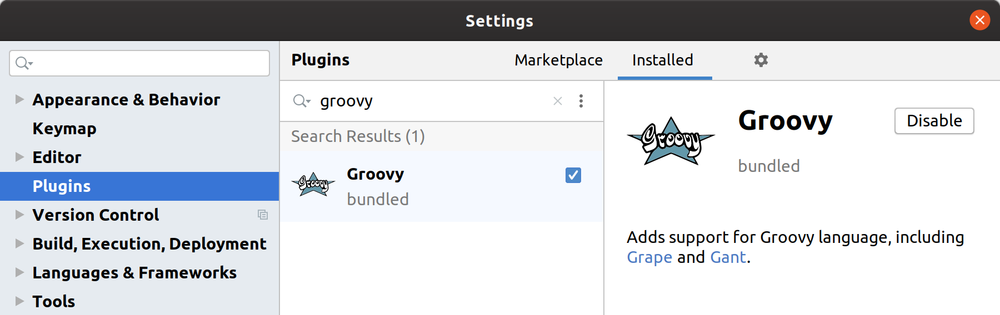
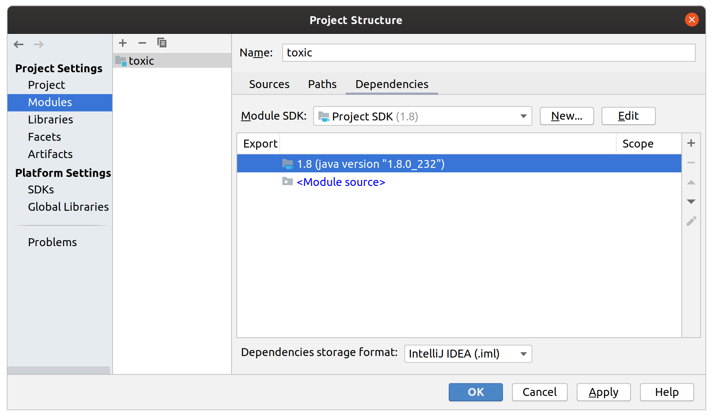

# Setup with Intellij™

### Dependencies

##### 1) Install a JDK (we recommend [AdoptOpenJDK](https://adoptopenjdk.net/))

##### 2) [Get the Groovy SDK](http://groovy-lang.org/)

##### 3) [Get Ant](https://ant.apache.org/)

##### 4) Open Intellij Settings and make sure you also have the Groovy plugin for Intellij

##### 5) Clone the project

`$ git clone https://github.com/stackct/toxic.git`

##### 6) Open the project and go to `File > Project Structure`

##### 7) Under 'Platform Settings > SDKs' and add your JDK installation

##### 8) Under 'Platform Settings > Global Libraries' add your groovy installation

##### 9) Under 'Project Settings > Project' set your JDK version

##### 10) Under 'Project Settings > Modules > Dependencies' make sure the correct JDK is selected for the TOXIC module

##### 11) Go to `Modules > Sources` and right click to mark folders:

- Mark `src` as "Sources"
- Mark `test` as "Tests"
- Mark `resources` as "Resources"

##### 11) Go to the `Paths` tab and set the output path and output directories
