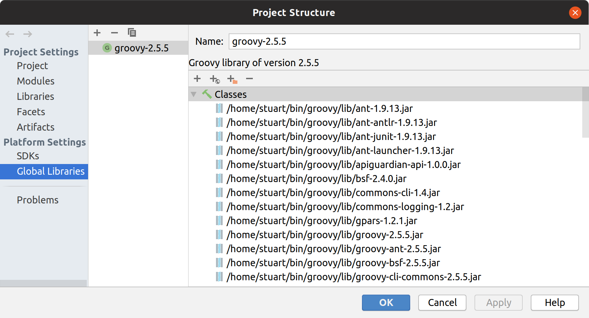
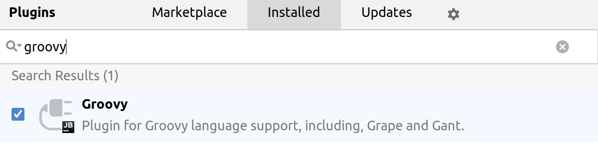
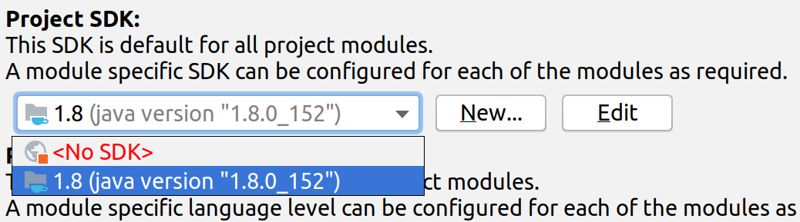
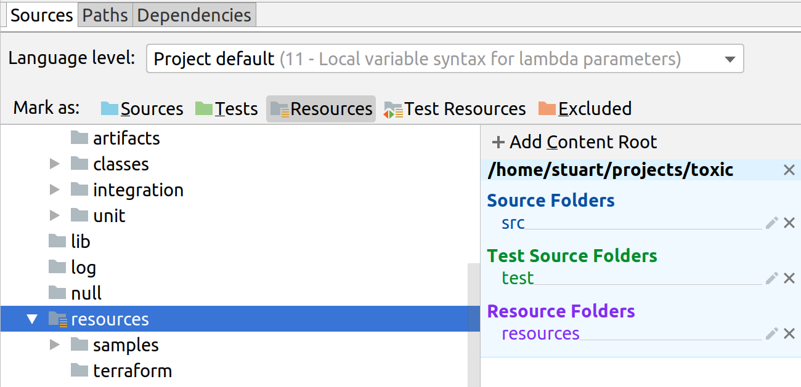
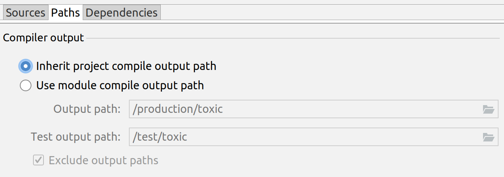

# Setup with Intellij™

### Prerequisites

---

#### 1) [Get the Groovy SDK](http://groovy-lang.org/)

#### 2) [Get Ant and add it to your terminal path](https://ant.apache.org/)

#### 3) Go to `File > Project Structure` and add Groovy to your Intellij Global Libraries

#### 4) Make sure you also have the Groovy plugin for Intellij

#### 5) Clone the project

`$ git clone https://github.com/stackct/toxic.git`

### Setup for development

---

Open the project and go to `File > Project Structure`

#### 1) Set your Java SDK

#### 2) Go to `Modules > Sources` and right click to mark folders:

- Mark `src` as "Sources"
- Mark `test` as "Tests"
- Mark `resources` as "Resources"

#### 3) VERY IMPORTANT! Be sure to click `Apply`

#### 4) Go to the `Paths` tab and set the output path and output directories

#### 5) Last step, run `ant` in terminal to build TOXIC!