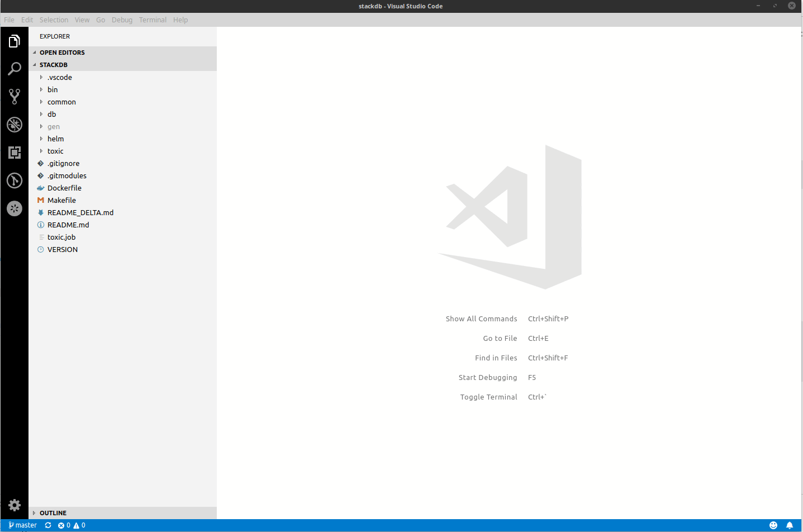
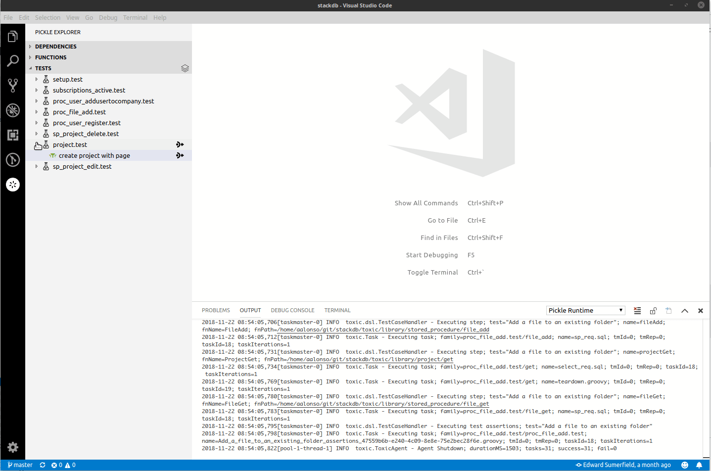
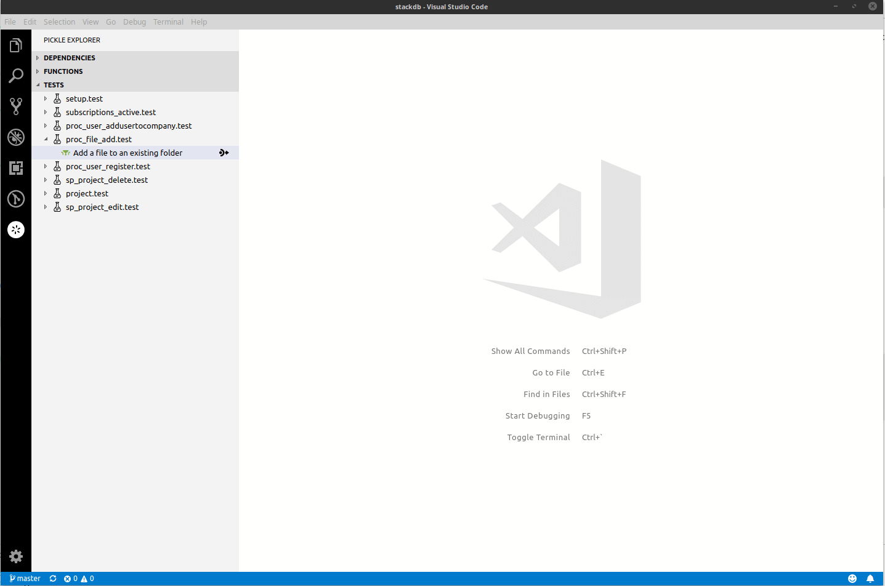

# Pickle Extension for Visual Studio Code

This extension provides code snippets, content navigation, and test execution support for Pickle.

## Requirements

* npm
* To run tests, you must have `toxic` installed and in your `PATH`.

## Installation

From the root of this repository, run:

```
make vscode
```

NOTE: If you are running on Windows, you are on your own.

## Features

* Code snippets
* Code navigation for Deps, Functions, and Tests
* Run tests (single, file, or all)

## Configuration Options

```
{
  // Enable notifications for failed tests
  "pickle.notifications.failure": true,

  // Enable notifications for successful tests
  "pickle.notifications.success": true,

  // List of runtime arguments in the format: -key=value
  "pickle.runtimeArgs": [] 
}
```

## Screencasts

### Navigation


### Authoring


### Test Execution


## Next

* Run tests based on tags (include/exclude)
* Run current test from Editor window via keystroke
* Show available functions provided by external dependencies
* Figure out how to unit/integration test the extension
